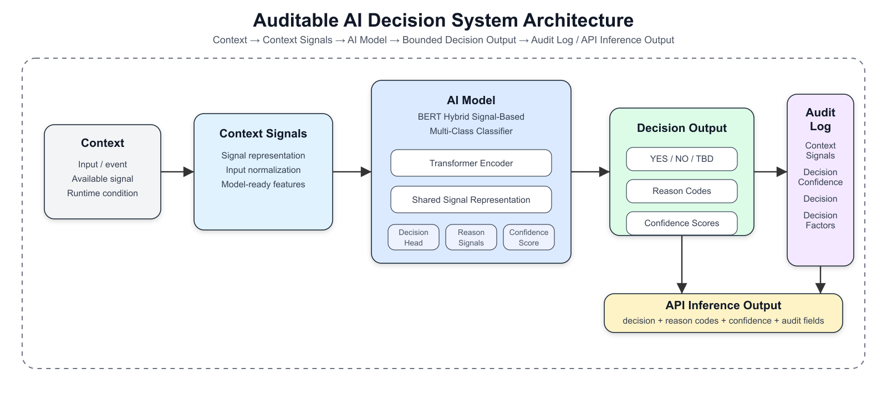
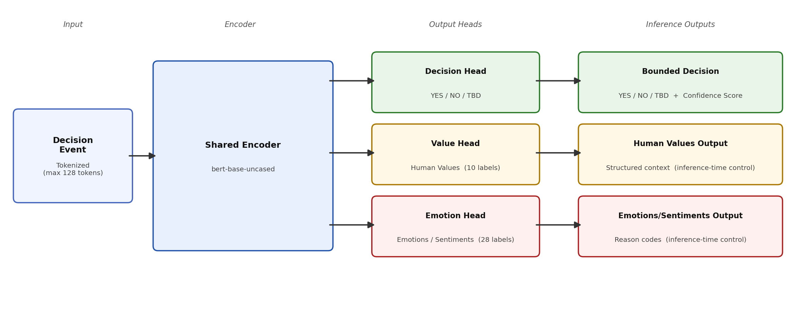

# EvaluatorDPT

**Auditable AI Decision System with Bounded Decisions, Explainability, and Confidence Scores**

*Sankaranarayanan Palamadai Chandrasekaran — Simple Machine Mind*

---

## What It Does

EvaluatorDPT is a BERT-based multi-task model that produces three outputs for every decision event:

| Output | Type | Description |
|---|---|---|
| **Decision** | 3-class | YES / NO / TBD (defer) |
| **Human Values** | 10-label multi-label | Structured context signal |
| **Emotions/Sentiments** | 28-label multi-label | Structured context signal |

The auxiliary outputs are **not discarded after training**. They are retained at inference time as control variables for downstream steering, thresholding, and reason-code generation — making every decision auditable.

Input/output contract: a context signal is mapped to a bounded decision, decision confidence, structured reason codes, and reason-code confidence scores.

---

## System Overview



---

## Key Results

Evaluated on a stratified held-out test split of **22,748 examples** from a corpus of up to **181,000** labeled decision events (TBD majority class at 60.3%).

| Method | Accuracy | Macro F1 | Micro F1 | Weighted F1 |
|---|---|---|---|---|
| Majority baseline (always TBD) | 0.6030 | 0.2508 | 0.6030 | 0.4537 |
| **EvaluatorDPT** | **0.8485** | **0.8215** | **0.8485** | **0.8506** |

**Per-class F1:**

| Class | Precision | Recall | F1 | Support |
|---|---|---|---|---|
| YES | 0.7683 | 0.9029 | 0.8302 | 5,871 |
| NO | 0.7164 | 0.7923 | 0.7524 | 3,159 |
| TBD | 0.9306 | 0.8381 | 0.8819 | 13,718 |

**Inference latency** (NVIDIA Tesla T4, 200 runs): p50 = 200 ms · p95 = 415 ms

---

## Architecture

The model uses `bert-base-uncased` as a shared encoder with three task-specific heads:

- **Decision head** — YES / NO / TBD + confidence score
- **Value head** — 10 Human Values labels
- **Emotion head** — 28 Emotions/Sentiments labels



---

## Paper

Full methodology, evaluation, ablation, and confusion analysis:

- [`paper/Auditable_AI_Decision_Systems_Bounded_Decisions.pdf.pdf`](paper/Auditable_AI_Decision_Systems_Bounded_Decisions.pdf.pdf) — compiled paper
- OSF preprint: [https://osf.io/ztnya/](https://osf.io/ztnya/)
- arXiv: `TBD` *(submission in progress)*

---

## Repository Layout

```
paper/          arXiv submission package (tex, bib, bbl, pdf, diagrams)
huggingface/    HuggingFace model card
inference/      Example inference interface
model/          Model configuration
data_schema/    Input / output schema definitions
docs/           System documentation
```

---

## Quickstart

```bash
pip install -r requirements.txt
python inference/predict.py
```

---

## Links

- HuggingFace: [pcsankar73s/EvaluatorModel](https://huggingface.co/pcsankar73s/EvaluatorModel)
- OSF preprint: [https://osf.io/ztnya/](https://osf.io/ztnya/)
- arXiv: TBD
- Pareto optimization notes: [`docs/pareto_optimization.md`](docs/pareto_optimization.md)
- “90 score” objective spec: [`docs/analysis/objective_90_spec.md`](docs/analysis/objective_90_spec.md)
- Contact: sankar@smsquared.ai

---

## License

See [LICENSE](LICENSE).
